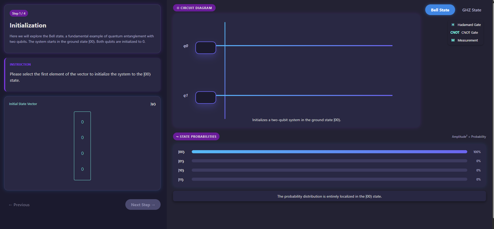
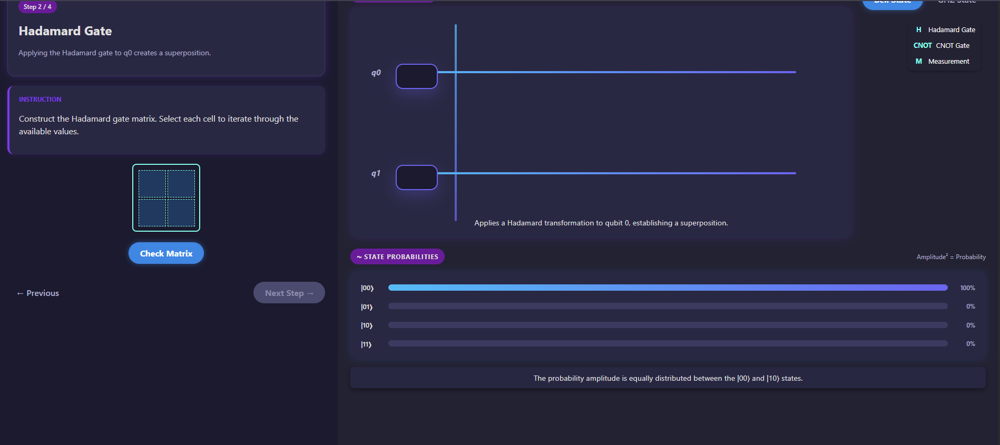
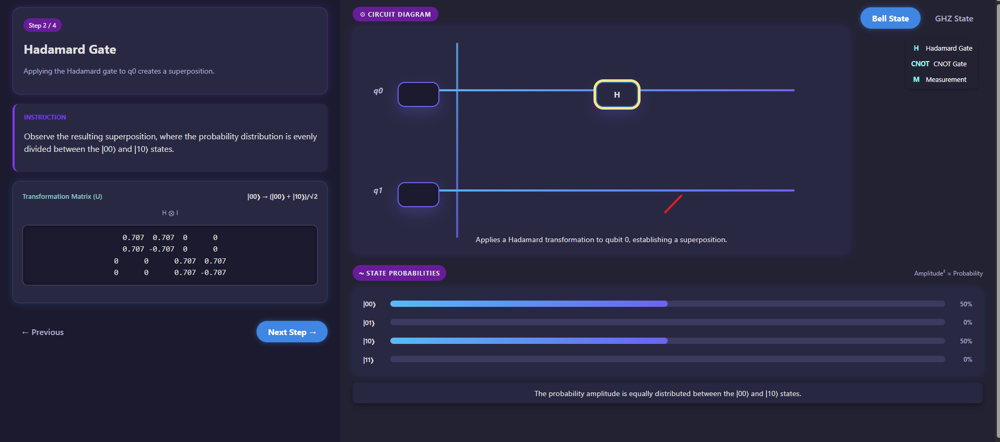
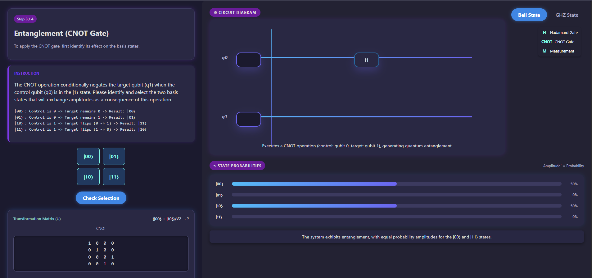
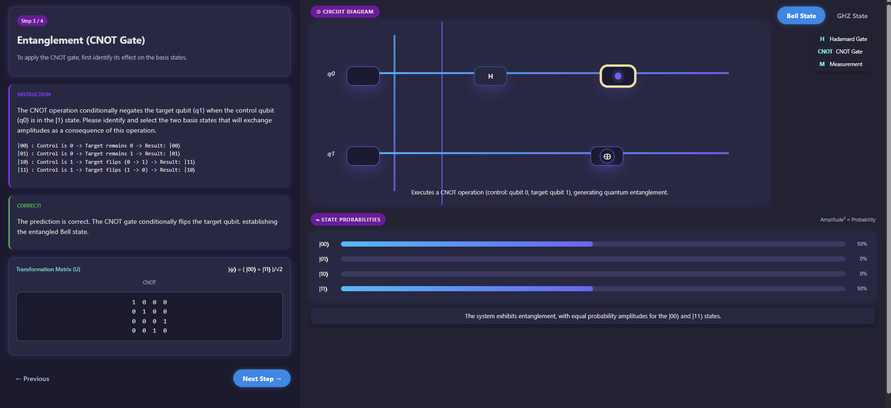
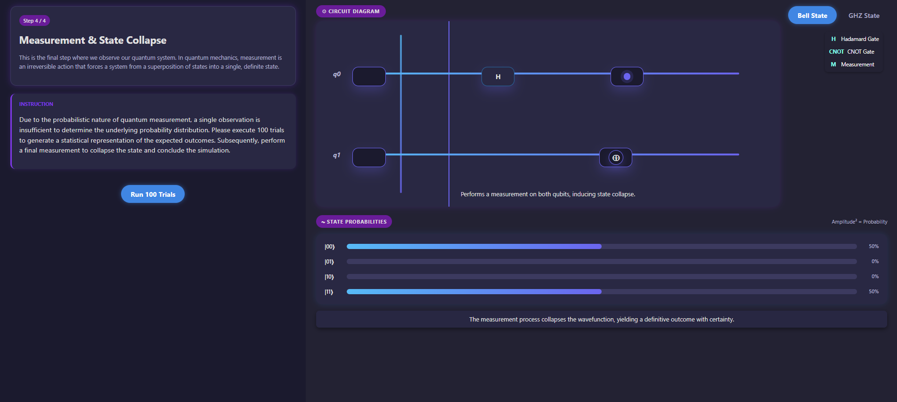
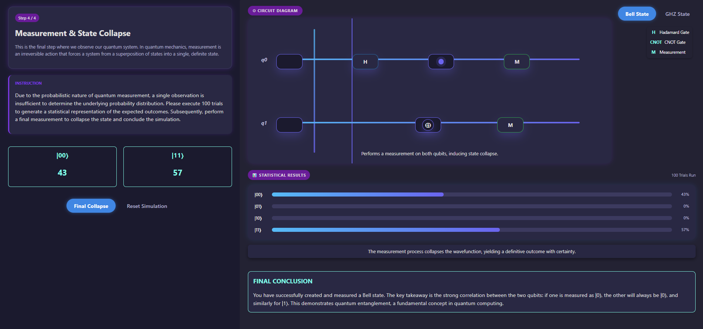
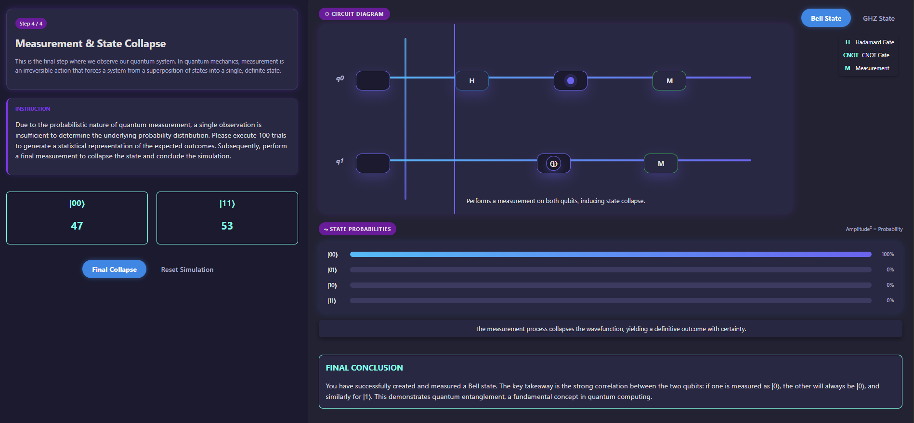

#### Step 1: Initialize the System

Select the first element of the vector to initialize the system to the |00⟩ state. Click the **Next** button to proceed to the following step.

#### Step 2: Apply Hadamard Gate

Construct the Hadamard gate matrix by selecting each cell to iterate through the available values.

#### Step 3: Observe State After Hadamard

Observe the circuit diagram and verify the state probabilities after applying the Hadamard gate.

#### Step 4: Apply CNOT Gate

Apply the CNOT gate by identifying and selecting the two basis states that will exchange amplitudes as a result of this operation.

#### Step 5: Observe Entangled State

Observe the circuit diagram and verify the state probabilities after applying the CNOT gate to create the Bell state.

#### Step 6: Statistical Measurement

Click **100 Trials** to generate a statistical representation of the expected measurement outcomes.

Observe the circuit diagram and state probabilities in the measurement results.

#### Step 7: Final Measurement

Perform a final measurement to collapse the quantum state and verify the predicted outcomes.

